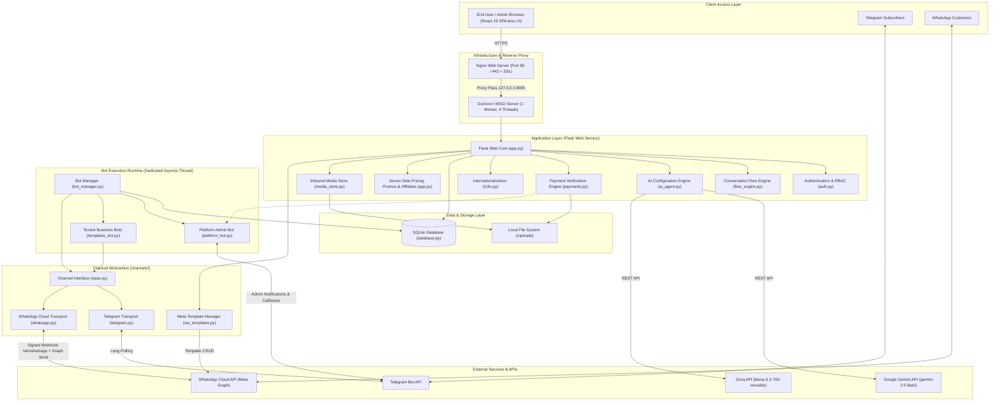
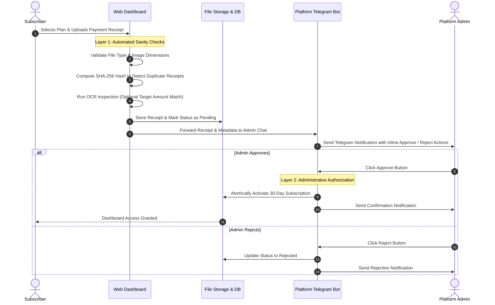

<div align="left">
  
</div>

# BotYalla

### The No-Code Telegram & WhatsApp Bot SaaS Platform for Businesses

BotYalla is a full-featured, multi-tenant SaaS platform that enables businesses, agencies, and creators to design, launch, and manage intelligent chat bots on **Telegram and WhatsApp** without writing a single line of code. Built with Python, Flask, `python-telegram-bot` and the WhatsApp Cloud API — behind a React 19 presentation layer — BotYalla combines a visual conversation flow engine, generative AI automation, built-in business templates, subscriber broadcasting, inbound media handling, real-time analytics, promo codes, an affiliate programme, and a dual-layer local payment verification pipeline.

---

## Table of Contents

- [System Architecture](#system-architecture)
  - [High-Level Architecture](#high-level-architecture)
  - [Execution and Threading Model](#execution-and-threading-model)
  - [Dual-Layer Payment Flow](#dual-layer-payment-flow)
  - [Core Modules and Responsibilities](#core-modules-and-responsibilities)
  - [Database Schema](#database-schema)
- [Key Features](#key-features)
- [Pre-Built Bot Templates](#pre-built-bot-templates)
- [Subscription Plans and Pricing](#subscription-plans-and-pricing)
- [Environment Configuration](#environment-configuration)
- [Platform Bot Admin Commands](#platform-bot-admin-commands)
- [Quick Start Guide](#quick-start-guide)
- [Production Deployment](#production-deployment)
  - [Automated Linux VPS Script](#automated-linux-vps-script)
  - [Docker Containerization](#docker-containerization)
- [Documentation Index](#documentation-index)
- [License](#license)
- [Author and Contact](#author-and-contact)

---

## System Architecture

### High-Level Architecture



---

### Execution and Threading Model

BotYalla separates web request servicing from continuous Telegram bot polling to maintain high responsiveness and state consistency:

- **Web Service**: Powered by Flask and WSGI (Gunicorn), handling administrative requests, user authentication, bot builder interfaces, payment processing, and analytics dashboards.
- **Bot Engine (`BotManager`)**: Runs an isolated background `asyncio` event loop thread started on application initialization.
- **Multi-Tenant Polling**: Each active bot runs as an independent `telegram.ext.Application` instance registered within the shared runtime manager.
- **Platform Management Bot**: Operates concurrently on the same event loop to listen for platform-level administrative callbacks and dispatch real-time alerts.

---

### Dual-Layer Payment Flow

To prevent unauthorized subscription activation while supporting regional payment channels without direct webhooks (e.g., Vodafone Cash, InstaPay, direct bank transfer), BotYalla employs a two-tier verification mechanism:



---

### Core Modules and Responsibilities

| Module | Primary Responsibility | Key Functions / Classes |
|---|---|---|
| `app.py` | Central Flask application, routing, session lifecycle, CSRF enforcement, and plan authorization. | Main application entry point, route definitions, error handlers. |
| `bot_manager.py` | Orchestration of tenant bots and the platform bot in a background `asyncio` event loop. | `BotManager`, `start_all()`, `start_bot()`, `stop_bot()`. |
| `flow_engine.py` | No-code dynamic conversational engine supporting branching, state transitions, and input capture. | `FlowEngine`, `handle_message()`, `handle_callback()`. |
| `templates_bot.py` | Domain-specific handlers for pre-built business models (Stores, Bookings, Support). | Template dispatchers, catalog renderers, booking slot calculators. |
| `ai_agent.py` | AI automation engine translating business prompts into complete bot configurations. | `call_gemini()`, `call_groq()`, offline fallback generator. |
| `payments.py` | Payment receipt validation, SHA-256 duplicate fingerprinting, and OCR analysis. | `verify_receipt()`, `compute_image_hash()`, `extract_ocr_data()`. |
| `platform_bot.py` | Administrative Telegram bot handling real-time notifications and approval callbacks. | `PlatformBot`, notification dispatchers, command handlers. |
| `database.py` | Database abstraction layer for SQLite with transactional safety. | Schema definitions, user management, bot CRUD, subscription state. |
| `auth.py` | Password encryption, hashing, and credential validation using Werkzeug security utilities. | `hash_password()`, `check_password()`. |
| `plans.py` | Subscription tier specifications, pricing constants, and feature boundary enforcement. | `PLANS`, `plan()`, `plan_name()`. |
| `i18n.py` | Localization repository supporting Arabic (RTL) and English (LTR). | Translation dictionaries, direction helper functions. |
| `tg_helpers.py` | Telegram token validation, admin linking, and shared message formatting. | `validate_token()`, `get_bot_info()`. |
| `channels/base.py` | Abstract transport interface every channel implements. | `Channel.send_text()`, `send_buttons()`, `normalize()`, `fetch_media()`. |
| `channels/telegram.py` | Telegram transport (long polling). | Message normalisation, keyboard handling. |
| `channels/whatsapp.py` | WhatsApp Cloud API transport (webhook), 24-hour window and monthly send quota. | Inbound normalisation, deduplication, two-step media download. |
| `channels/wa_templates.py` | Meta message-template validation and lifecycle. | Name/category/length/variable rule checks, create, list, delete. |
| `media_store.py` | Private storage for inbound customer media; type inferred from magic bytes, never the declared header. | `save()`, `kind_of()`, `quota_left()`, `path_of()`. |
| `frontend/` | React 19 + Vite 8 + Tailwind 4 presentation layer, compiled into `static/dist/`. | `AppShell.jsx`, `kit.jsx`, `views/*.jsx`. |

---

### Database Schema

| Table Name | Description | Key Attributes |
|---|---|---|
| `users` | User accounts and dashboard credentials | `id`, `username`, `password`, `role` (admin, support, user), `created_at`, `is_blocked` |
| `bots` | Individual Telegram bot configurations | `id`, `user_id`, `token`, `template`, `config_json`, `is_active`, `created_at` |
| `subscriptions` | Active user billing plans and validity periods | `id`, `user_id`, `plan`, `expires_at`, `status`, `created_at` |
| `payments` | Audit logs of uploaded receipts and verification state | `id`, `user_id`, `method`, `amount`, `receipt_file`, `image_hash`, `status`, `reviewed_at` |
| `platform` | Global platform settings and payment destination details | `key`, `value` (Vodafone Cash, InstaPay, Admin Bot Token, Admin Chat ID) |
| `events` | Real-time analytics event stream | `id`, `bot_id`, `event_type` (start, lead, order, booking), `metadata_json`, `created_at` |
| `bot_users` | Subscribers and lead directory for each managed bot | `id`, `bot_id`, `telegram_id`, `username`, `first_name`, `created_at` |
| `chat_state` | Live conversation state, persisted so in-flight chats survive a restart | `bot_id`, `peer`, `step`, `data_json`, `updated_at` |
| `media` | Inbound customer files (kind inferred from magic bytes, served owner-only) | `id`, `bot_id`, `peer`, `fname`, `kind`, `mime`, `bytes`, `created_at` |
| `promos` / `promo_uses` | Discount codes and their redemption ledger; `UNIQUE(promo_id,payment_id)` blocks double counting | `code`, `kind`, `value`, `plan`, `max_uses`, `used`, `per_user_once`, `expires_at` |
| `affiliates` / `referrals` | Affiliate accounts and referral conversions; commission credited on first approved payment | `user_id`, `code`, `rate_pct`, `total_earned`, `paid_out` · `referred_user_id`, `payment_id`, `commission`, `converted_at` |
| `plan_overrides` | Owner-set price or discount per plan, applied by the server-side pricing engine | `plan`, `price`, `discount_pct` |
| `usage_msgs` | Monthly outbound WhatsApp counters enforcing the plan quota | `bot_id`, `owner_id`, `month`, `sent` |
| `seen_msgs` | Inbound message IDs already processed — WhatsApp retries must not act twice | `channel`, `msg_id`, `created_at` |
| `reminder_log` | Which expiry reminders were delivered; cleared on renewal | `user_id`, `kind`, `sent_at` |
| `bot_requests` | Custom-bot enquiries submitted from the dashboard | `id`, `user_id`, `business`, `description`, `budget`, `contact`, `status` |
| `leads` / `orders` / `bookings` | Captured leads, store orders, and appointment bookings per bot | `bot_id`, `data_json` / `items`, `total` / `service`, `slot`, `status` |

---

## Key Features

- **No-Code Conversational Flow Builder**: Visual step-by-step tree constructor enabling interactive menus, button callbacks, variable collection, and automated replies without writing code.
- **AI-Powered Bot Generation**: Generate full bot settings, greetings, product catalogs, and responses from simple business descriptions using Google Gemini (`gemini-2.5-flash`) or Groq (`llama-3.3-70b-versatile`), supported by a built-in offline algorithmic fallback engine.
- **Audience Broadcasting**: Transmit mass marketing campaigns, announcements, and media updates directly to subscribers across any managed bot.
- **Real-Time Analytics Dashboard**: Monitor conversation metrics, active user engagement, lead generation rates, store orders, and appointment bookings, with full CSV export capabilities.
- **Full Internationalization (i18n)**: Seamless bidirectional support for Arabic (RTL) and English (LTR) across all dashboard screens and bot responses.
- **Multi-Role Administration**: Dedicated web administrative suite with access controls (`admin`, `support`, `user`), subscriber tracking, and manual tier overrides.
- **Dual-Channel Delivery**: The same no-code flow runs on **Telegram** (long polling) and **WhatsApp Cloud API** (signed webhook) through one abstract `Channel` interface — with 24-hour window compliance, inbound deduplication, and per-plan monthly send quotas.
- **WhatsApp Message Templates**: Create, list, and delete Meta message templates from the dashboard, with full client-side validation of Meta's naming, category, length, and variable-numbering rules before submission.
- **Inbound Media Handling**: Customer photos, voice notes, documents, and video are stored outside `static/`, typed from **magic bytes rather than the declared header**, quota-limited per plan, and served only to the bot owner with `nosniff` and forced download for non-media types.
- **Server-Side Pricing Engine**: A single source of truth computes every amount — plan price, owner overrides, and promo discounts. No amount is ever read from a form.
- **Promo Codes & Affiliate Programme**: Percentage or fixed-value codes with expiry, usage caps, plan scoping, and one-per-user limits; plus referral tracking with commission credited atomically on the first approved payment.
- **Subscription Lifecycle**: 30-day terms, early renewal stacking onto remaining time, and automated pre-expiry reminders delivered through the platform bot without duplicates.
- **Robust Security Posture**: Session encryption via configurable secrets, secure HTTPS cookie enforcement, Werkzeug password hashing, CSRF protection, brute-force login throttling, HMAC-SHA256 webhook signature verification (fail-closed), and per-request re-validation of role and block status from the database.

---

## Pre-Built Bot Templates

| Template | Target Use Case | Key Capabilities |
|---|---|---|
| **Mini E-Commerce Store** | Retail, restaurants, boutique shops, digital products | Product catalog with images, categories, shopping cart, checkout, order notifications. |
| **Bookings & Appointments** | Clinics, salons, consultants, service businesses | Automated calendar scheduling, dynamic slot calculation, double-booking prevention. |
| **Customer Support & Leads** | Agencies, corporate inquiries, service desks | Structured lead capture, contact forms, automated FAQs, instant admin notification. |
| **Custom Flow Builder** | Generalized business workflows, interactive forms | Step-by-step decision trees, custom button paths, custom input capture. |

---

## Subscription Plans and Pricing

Plan configuration and tier definitions can be modified in `plans.py`:

| Plan Tier | Price | Bot Limit | Channels | WhatsApp service msgs / mo | Media Files / mo | AI | Broadcast |
|---|---|---|---|---|---|---|---|
| **Free** | 0 EGP / mo | 1 Bot | Telegram only | — | 100 | The real setup agent · 3 sessions / mo | Disabled |
| **Merchant** | 299 EGP / mo | 3 Bots | Telegram only | — | 1,000 | 30 sessions / mo · 500 AI replies | Enabled |
| **WhatsApp** | 899 EGP / mo | 5 Bots | Telegram + WhatsApp | 2,000 | 3,000 | 60 sessions / mo · 1,500 AI replies · our team connects WhatsApp for you | Enabled |
| **Agency** | 2,999 EGP / mo | Unlimited | Telegram + WhatsApp | 10,000 | 20,000 | 300 sessions / mo · 10,000 AI replies | Enabled |

Annual billing is 30% off (`plans.ANNUAL_FACTOR`). The legacy Pro (199) and Business (499) plans remain in `plans.py` only for subscribers who already hold them — they are not sold. WhatsApp **marketing** messages are never inside a plan: they are paid per message from the wallet.

> WhatsApp is closed on the Free tier and metered above it because Meta bills **per message** — an unlimited allowance on an active tenant can cost more than the subscription itself. Telegram is free to operate, so it carries no message cap.

Admin and support accounts bypass every plan limit. Owners can additionally override any plan's price or apply a percentage discount from `/admin/pricing` without touching `plans.py`.

---

## Environment Configuration

The platform loads configuration values from `.env`. An annotated template is available in `.env.example`:

| Parameter | Type | Default Value | Description |
|---|---|---|---|
| `FLASK_SECRET` | String | Generated Key | Secret key used for signing session cookies. |
| `COOKIE_SECURE` | Integer | `0` | Set to `1` in production behind HTTPS; `0` for local HTTP development. |
| `ADMIN_USER` | String | `admin` | Default administrative username created automatically on first run. |
| `ADMIN_PASS` | String | `change_this_strong_password_here` | Default administrative password created on first run. |
| `HOST` | String | `127.0.0.1` | Local network binding address for development. |
| `PORT` | Integer | `5000` | Local network port for development. |
| `GEMINI_API_KEY` | String | None | Google Gemini API key for AI generation features. |
| `GROQ_API_KEY` | String | None | Groq API key for alternative Llama 3.3 AI generation. |
| `META_APP_ID` | String | None | Meta app ID used by the WhatsApp Cloud API integration. |
| `BOTYALLA_DB` | Path | `botyalla.db` | Database file. Test suites set this to a temporary path — **read once at import time**. |
| `BOTYALLA_UPLOADS` | Path | `./uploads` | Payment-receipt directory. Overridden by tests so fixtures never mix with real receipts. |
| `BOTYALLA_LOGS` | Path | `./logs` | Rotating log directory (`botyalla.log`, 10 MB × 5). Tests that call `bootstrap()` point it at a temp dir. |
| `PUBLIC_URL` | URL | None | Canonical origin, e.g. `https://botyalla.com`, used for links sent by email. **Required for password-reset emails** — without it no link is sent, because links are never built from the request's `Host` header. |
| `SMTP_HOST` / `SMTP_PORT` | String / Integer | None / `587` | Outgoing mail server. Without `SMTP_HOST` and `SMTP_FROM` no email is sent (logged, never an error). |
| `SMTP_USER` / `SMTP_PASS` | String | None | SMTP credentials. |
| `SMTP_FROM` | String | None | Sender, e.g. `BotYalla <no-reply@yourdomain.com>`. |
| `SMTP_REPLY_TO` | String | support email | Where customer replies go (the sender is no-reply). Defaults to the platform support email (`info@botyalla.com`). |
| `SMTP_TLS` | String | `starttls` | `starttls` (587), `ssl` (465) or `none`. |
| `GOOGLE_SITE_VERIFICATION` | String | None | Google Search Console verification token — rendered as a `google-site-verification` meta tag on public pages. |

> **Public website.** `/` is the public landing page for everyone (the dashboard lives at `/dashboard`); `/terms`, `/privacy`, `/refund` and `/acceptable-use` are the policies; `/robots.txt`, `/sitemap.xml`, `/site.webmanifest` and `/.well-known/security.txt` are served by the app. Set `PUBLIC_URL` in production so canonical, social-preview and sitemap links use your real domain. Go-live checklist: [docs/WEBSITE_LAUNCH.md](docs/WEBSITE_LAUNCH.md).

> **Never commit real credentials.** `.env` is git-ignored — keep it that way, and never hard-code an admin password inside a tracked file such as a test.

**WhatsApp secrets live in platform settings, not `.env`.** Set `wa_verify_token` and `wa_app_secret` from `/admin/platform`. Until both are set, the `/wh/whatsapp` webhook **rejects every request by design** (fail-closed) rather than accepting unsigned traffic.

---

## Platform Bot Admin Commands

When the platform notification bot is configured with your Telegram Admin ID, you can manage operations remotely via Telegram:

| Command | Access Level | Description |
|---|---|---|
| `/stats` | Admin | Real-time platform summary: total users, active subscriptions, revenue. |
| `/pending` | Admin | Displays pending payment submissions with interactive Approve and Reject buttons. |
| `/users` | Admin | Lists the most recently registered user accounts on the platform. |
| `/revenue` | Admin | Provides a financial breakdown of income generated per subscription tier. |

---

## Quick Start Guide

### 1. Prerequisites

- Python 3.11 or higher
- Git

### 2. Clone and Setup Environment

```bash
# Clone repository
git clone https://github.com/USERNAME/BotYalla.git
cd BotYalla

# Create virtual environment
python -m venv venv

# Activate virtual environment
# Windows (PowerShell):
.\venv\Scripts\Activate.ps1

# Windows (Command Prompt):
.\venv\Scripts\activate.bat

# Linux / macOS:
source venv/bin/activate
```

### 3. Install Dependencies

```bash
pip install -r requirements.txt
```

### 4. Configure Environment Variables

```bash
# Copy template configuration
# Linux / macOS:
cp .env.example .env

# Windows:
copy .env.example .env
```

Generate a secure Flask secret key:

```bash
python -c "import secrets; print(secrets.token_hex(32))"
```

Paste the generated string into `FLASK_SECRET` inside `.env`.

### 5. Build the Frontend

The dashboard and landing page are React, compiled into `static/dist/`. The repository ships a built bundle, so this step is only needed after changing anything under `frontend/src/`:

```bash
cd frontend
npm install
npm run build        # or: npm run watch — rebuilds on save during development
cd ..
```

### 6. Start the Server

```bash
python app.py
```

Navigate to `http://127.0.0.1:5000` in your browser.

> **Security Advisory**: On first start the admin account is created from `ADMIN_USER` / `ADMIN_PASS`. If `ADMIN_PASS` is not set, a random password is generated and printed **once** to the log — there is no fixed default password. Change it after your first login via the Account page.

### 7. Run the Tests

```bash
./run_tests.sh              # every suite, one process per file
python tests/test_flow.py   # a single suite
```

> Do **not** run `pytest tests/` across the whole directory. `database.DB_PATH` is resolved once at import time and each suite sets `BOTYALLA_DB` before importing it — under a single pytest process the first suite wins and the rest collide on its database. `run_tests.sh` gives each file its own process, which is the isolation the suites were written for.

---

## Production Deployment

### Automated Linux VPS Script

An automated deployment script is available in `deploy/hostinger_deploy.sh` for Ubuntu/Debian servers. It manages package installation, user isolation, virtual environments, the frontend build, systemd daemonization, Nginx, firewall, and daily backups. It is idempotent — running it twice is safe. See `docs/PRODUCTION.md` for the full runbook.

```bash
# Run automated setup script
sudo bash deploy/hostinger_deploy.sh yourdomain.com

# Configure SSL certificate via Let's Encrypt
sudo certbot --nginx -d yourdomain.com -d www.yourdomain.com
```

### Docker Containerization

Run BotYalla within an isolated Docker container:

```bash
# Build the Docker image
docker build -t botyalla .

# Run the container on port 8000
docker run -d -p 8000:8000 --env-file .env --name botyalla_app botyalla
```

---

## Documentation Index

| Documentation File | Location | Content Overview |
|---|---|---|
| **Security Policy** | [SECURITY.md](SECURITY.md) / [docs/SECURITY.md](docs/SECURITY.md) | Vulnerability disclosure, threat matrices, and production hardening. |
| **User Guide** | [docs/USER_GUIDE.md](docs/USER_GUIDE.md) | Platform owner workflows, client bot creation, and dashboard usage. |
| **Deployment Guide** | [docs/DEPLOYMENT.md](docs/DEPLOYMENT.md) | Production server setup, Nginx reverse proxy, and SSL configuration. |
| **Architecture Guide** | [docs/ARCHITECTURE.md](docs/ARCHITECTURE.md) | Component architecture, event loops, and database design. |
| **Hostinger VPS Guide** | [docs/HOSTINGER.md](docs/HOSTINGER.md) | Specific setup instructions for Hostinger infrastructure. |
| **Production Runbook** | [docs/PRODUCTION.md](docs/PRODUCTION.md) | Full deployment runbook, systemd, backups, and operational checks. |
| **WhatsApp Integration** | [docs/WHATSAPP.md](docs/WHATSAPP.md) | Cloud API setup, Meta requirements, the 24-hour window, templates, and cost model. |
| **Code Review** | [REVIEW.md](REVIEW.md) | Full security and correctness review, open findings, and their priorities. |
| **Agent Rules** | [AGENTS.md](AGENTS.md) / [PROJECT_MEMORY.md](PROJECT_MEMORY.md) | Mandatory conventions, invariants, and project context for any contributor or AI agent. |

---

## License

This project is licensed under the terms of the MIT License. See the [LICENSE](LICENSE) file for complete license terms.

---

## Author and Contact

Developed and maintained by **Youssef Alsherief**.

| Channel | Details |
|---|---|
| **Website** | [youssefalsherief.tech](https://youssefalsherief.tech/) |
| **Email** | info@botyalla.com |
| **Phone** | +20 109 758 5951 |
