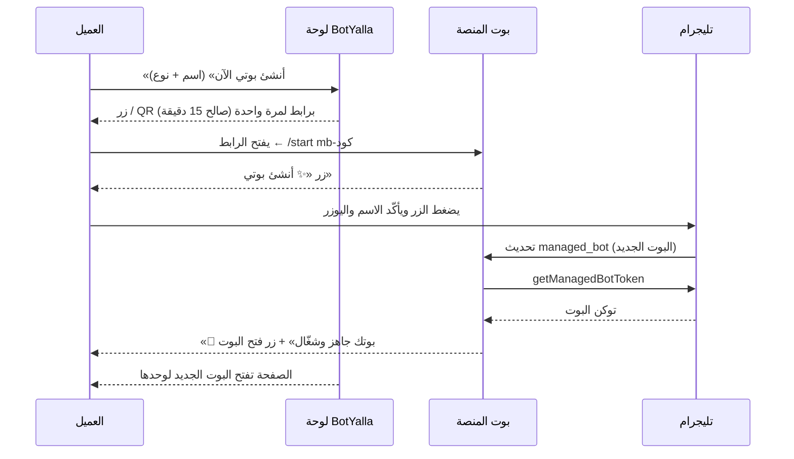

# دليل تفعيل «إنشاء البوت بضغطة» — Telegram Managed Bots

> **الخلاصة في 3 سطور**
> 1. افتح محادثة **@BotFather** واضغط زر **Open** (الزرّ الأزرق جنب خانة الكتابة) — **مش** أمر `/newapp`.
> 2. اختار **بوت المنصة** ← إعداداته ← فعّل **Bot Management Mode**.
> 3. ارجع للمنصة: **الأدمن ← إعدادات المنصة ← حفظ**. السطر «الإنشاء بضغطة» لازم يبقى «مفعّل».
>
> مفيش أي رابط أو دومين أو Web App مطلوب للميزة دي.

---

## 0. إيه اللي حصل معاك؟ (أمر `/newapp`)

اللي في صورتك (طلب صورة 640×360، ثم GIF، ثم **Web App URL**) هو معالج **`/newapp`** — وده بيعمل
**Mini App**: موقع ويب بيفتح جوه تليجرام. **مالوش أي علاقة** بالإنشاء بضغطة، ومش محتاجينه.

**اعمل إيه دلوقتي:** ابعت `/cancel` لـ BotFather وخلاص. ولو كنت كمّلت للآخر واتعمل تطبيق، مش هيأثر على أي حاجة.

| الأمر / الخيار | بيعمل إيه | محتاجه؟ |
|---|---|---|
| `/newbot` | بيعمل بوت جديد ويديك توكن | مرة واحدة بس: عشان تعمل **بوت المنصة** نفسه (لو مش موجود) |
| `/newapp` | بيعمل Mini App (موقع ويب جوه تليجرام) — بيطلب Web App URL | **لا** ❌ |
| زر **Open** ← **Bot Management Mode** | بيدّي بوت المنصة صلاحية إنشاء بوتات لعملائك بموافقتهم | **أيوه** ✅ ده المطلوب |

> ملاحظة: زر **Open** بيفتح «تطبيق BotFather المصغّر» (BotFather Mini App) — ده تطبيق تليجرام نفسه لإدارة
> بوتاتك. الاسم فيه كلمة «Mini App» وده سبب اللخبطة، لكنه **مش** إنك تعمل Mini App جديد.

---

## 1. الفكرة ببساطة — مين بيعمل إيه؟

- **بوت المنصة**: البوت اللي توكنه محطوط في «الأدمن ← إعدادات المنصة» (هو نفسه اللي بيبعتلك تنبيهات الدفع).
  ده «المدير».
- **Bot Management Mode**: إعداد رسمي من تليجرام (Bot API 9.6 — أبريل 2026) بيسمح للبوت المدير إنه يطلب
  إنشاء بوت **نيابةً عن مستخدم** — والمستخدم لازم يأكّد بنفسه جوه تليجرام.
- **العميل**: بيضغط زر في لوحته ← تليجرام يعرض شاشة إنشاء فيها الاسم واليوزر جاهزين ← يأكّد ← المنصة
  تستلم توكن البوت الجديد تلقائياً وتشغّله وتربطه بحسابه.



---

## 2. قبل ما تبدأ — راجع الحاجات دي

- [ ] **بوت المنصة موجود** ومحطوط توكنه في «الأدمن ← إعدادات المنصة ← توكن بوت المنصة».
      لو مش موجود: `/newbot` لـ BotFather مرة واحدة، واختار اسم زي `BotYalla`.
- [ ] **رقم الأدمن (admin_chat_id)** متسجّل في نفس الصفحة. **من غيره بوت المنصة مش بيشتغل أصلاً.**
      أسهل طريقة تعرف رقمك: ابعت أي رسالة لـ **@userinfobot** وهيردّ برقمك (Id).
- [ ] **إنت صاحب بوت المنصة** في BotFather (نفس حساب تليجرام اللي عمله).
- [ ] **تطبيق تليجرام محدَّث** لآخر إصدار (الميزة من أبريل 2026) — على الموبايل وعلى الكمبيوتر.
- [ ] **السيرفر محدَّث**:
      ```bash
      cd /opt/botyalla && sudo -u botyalla .venv/bin/pip install -r requirements.txt
      sudo systemctl restart botyalla
      ```
      (عدّل المسار واسم المستخدم لو مختلفين عندك.) المكتبة المطلوبة `python-telegram-bot==22.8`.
- [ ] **نسخة واحدة بس شغّالة بتوكن بوت المنصة**. لو شغّال المشروع على جهازك وعلى السيرفر بنفس التوكن، تليجرام
      بيرفض واحد منهم (Conflict 409) والتحديثات بتضيع.

---

## 3. الخطوات بالتفصيل (حوالي 3 دقايق)

### الخطوة 1 — افتح BotFather
افتح محادثة **@BotFather** على تليجرام (الموبايل أسهل).

### الخطوة 2 — اضغط زر **Open**
تحت، جنب خانة الكتابة، فيه زرّ أزرق مكتوب عليه **Open** (باين في صورتك على الشمال تحت).
هيفتح شاشة إدارة البوتات (BotFather Mini App).

> لو الزر مش ظاهر: حدّث تليجرام، أو جرّب من تطبيق الموبايل.

### الخطوة 3 — اختار بوت المنصة
هتظهر قائمة بكل بوتاتك. اضغط على **بوت المنصة** (مش أي بوت عميل).

### الخطوة 4 — فعّل **Bot Management Mode**
ادخل على إعدادات البوت (**Bot Settings**) ودوّر على **Bot Management Mode** وفعّله.

> أسماء الشاشات ممكن تختلف شوية حسب نسخة تليجرام، لكن اسم الخيار نفسه حسب توثيق تليجرام الرسمي هو
> **Bot Management Mode**، وبيتفعّل من إعدادات البوت داخل BotFather Mini App.

### الخطوة 5 — ارجع للمنصة واضغط «حفظ»
**الأدمن ← إعدادات المنصة** ← اضغط **حفظ** (من غير ما تغيّر أي حاجة).

ليه؟ المنصة بتقرأ الإعداد ده من تليجرام (`getMe` ← `can_manage_bots`) **لما بوت المنصة يبدأ**. الحفظ بيعيد
تشغيل بوت المنصة فيقرأ القيمة الجديدة. (إعادة تشغيل الخدمة `sudo systemctl restart botyalla` بتعمل نفس الشيء.)

### الخطوة 6 — اتأكد إنه اشتغل
في نفس الصفحة، سطر **«الإنشاء بضغطة (Managed Bots)»** لازم يبقى:

> 🟢 **مفعّل — العملاء ينشئون بوتاتهم بضغطة · @اسم_بوت_المنصة**

طريقة تانية للتأكد (للمطوّر): افتح في المتصفح
`https://api.telegram.org/bot<توكن بوت المنصة>/getMe` ولازم تلاقي `"can_manage_bots": true`.
⚠️ الرابط ده فيه التوكن — ماتبعتوش لحد وماتصوّروش.

---

## 4. جرّبها بنفسك كأنك عميل

1. ادخل بحساب تجريبي (أو حسابك).
2. **لوحتي** ← بطاقة **«أنشئ بوتك على تليجرام بضغطة»** ← اكتب اسم النشاط واختار النوع ← **«أنشئ بوتي الآن»**.
3. **على الكمبيوتر**: امسح الـQR بكاميرا الموبايل. **على الموبايل**: اضغط **«افتح تليجرام»**.
4. تليجرام هيفتح بوت المنصة ويبعتلك رسالة، وتحت خانة الكتابة زرّ **«✨ أنشئ بوتي»** ← اضغطه.
5. تليجرام يعرض شاشة إنشاء البوت: **الاسم واليوزر جاهزين** (تقدر تعدّلهم) ← **أكّد**.
6. خلال ثواني: رسالة **«🎉 بوتك @… جاهز وشغّال!»** + زرّ **«🤖 افتح بوتك»** — وصفحة المنصة تفتح صفحة البوت الجديد لوحدها.

الحالة اللي بتظهر في اللوحة أثناء ده:
`في انتظار فتح الرابط…` ← `تمام ✓ اضغط «أنشئ بوتي» وأكّد` ← `بنجهّز بوتك…` ← `بوتك جاهز! 🎉`

البوت الجديد بيطلع **مشغَّل**، وتنبيهات الطلبات بتوصل لحساب تليجرام اللي أكّد الإنشاء — من غير أي ربط يدوي.

---

## 5. لو حاجة ما اشتغلتش

| اللي بيحصل | السبب غالباً | الحل |
|---|---|---|
| بطاقة «بضغطة» مش ظاهرة للعميل، والأدمن بيشوف رسالة «لتفعيل الإنشاء بضغطة…» | الوضع مش مفعّل، أو بوت المنصة واقف | الخطوات 2–5 |
| «إعدادات المنصة» لسه بتقول «غير مفعّل» رغم إني فعّلته | ماضغطتش «حفظ» بعد التفعيل | اضغط «حفظ» أو أعد تشغيل الخدمة |
| بوت المنصة مش بيرد خالص | التوكن أو رقم الأدمن ناقص، أو نسخة تانية شغّالة بنفس التوكن | راجع القسم 2، واقفل أي نسخة محلية |
| زر «✨ أنشئ بوتي» مش ظاهر في تليجرام | تطبيق تليجرام قديم | حدّث التطبيق — أو اضغط الزر الاحتياطي **«افتح شاشة إنشاء البوت»** اللي بيجي في نفس المحادثة |
| «الرابط غير صالح أو انتهت صلاحيته» | عدّت 15 دقيقة أو الرابط اتستخدم قبل كده | ارجع للوحة واضغط «أنشئ بوتي الآن» من جديد |
| تليجرام بيقول اليوزر محجوز | حد تاني واخده | عدّله في شاشة تليجرام (لازم ينتهي بـ `bot`) |
| «وصلت لحد البوتات في باقتك» | الباقة المجانية = بوت واحد | رقّي الباقة أو امسح بوت قديم |
| «تليجرام أنشأ البوت لكن ماقدرناش نستلمه» | `getManagedBotToken` فشل (غالباً مؤقت) | البوت اتعمل فعلاً في حساب العميل: خُد توكنه من BotFather (`/mybots`) واستخدم **«أو أنشئه يدوياً بتوكن»**. ولو اتكرر، شوف السجل (تحت) |

**السجل على السيرفر:**
```bash
journalctl -u botyalla -f
```
الرسائل المهمة بتبدأ بـ `managed_bots` — مثلاً `managed bot #12 created` لما ينجح، أو
`getManagedBotToken failed` / `without a linked request` لما يفشل.

---

## 6. أسئلة شائعة

**هل ده رسمي وآمن؟**
أيوه. دي ميزة رسمية من تليجرام (Bot API 9.6، 3 أبريل 2026). كل إنشاء لازم العميل يأكّده بنفسه جوه تليجرام،
والمنصة **عمرها ما بتشوف رقم العميل ولا كود الدخول**. التوكن بيوصل من تليجرام مباشرة (`getManagedBotToken`)
وبيتحفظ **متشفّر** في قاعدة البيانات.

**مين مالك البوت؟**
العميل نفسه — البوت في حساب تليجرام بتاعه، والمنصة بتشغّله بتوكنه زي أي بوت تاني.

**محتاج دومين أو HTTPS أو Webhook؟**
لا. بوت المنصة شغّال بـ polling. الحاجة الوحيدة: لو `PUBLIC_URL` في `.env` بيبدأ بـ `https://`، رسالة النجاح
بيبقى فيها زرّ «⚙️ لوحة التحكم».

**الطريقة اليدوية (توكن BotFather) لسه شغّالة؟**
أيوه دايماً — تحت البطاقة: **«أو أنشئه يدوياً بتوكن من BotFather»**. ولو الوضع مش مفعّل، اللوحة بتعرض الطريقة
اليدوية لوحدها.

**لازم أعمل Mini App؟**
لا. انسَ `/newapp` خالص.

**الصفحة الرئيسية بتتكلم عن الإنشاء بضغطة — لازم أفعّله قبل الإطلاق؟**
أيوه. البطل والخطوات والأسئلة الشائعة بقت مبنية على الإنشاء بضغطة، ففعّل **Bot Management Mode** قبل ما
تنشر الموقع للناس.

---

## 7. للمطوّر: فين الكود؟

| الجزء | الملف |
|---|---|
| الرابط لمرة واحدة، زر الإنشاء، استلام التوكن، إنشاء البوت وتشغيله | `managed_bots.py` |
| فرع `/start mb-…` في بوت المنصة، ومعالج تحديث `managed_bot` | `platform_bot.py` |
| قراءة `can_manage_bots` عند التشغيل، و`allowed_updates` تشمل `managed_bot` | `bot_manager.py` ← `_start_platform` |
| المسارات `POST /bot/create/managed` و`GET /bot/create/managed/<id>` (متابعة الحالة) | `app.py` |
| البطاقة في اللوحة (QR + متابعة الحالة كل ثانيتين) | `frontend/src/app/views/Dashboard.jsx` ← `OneTapCreate` |
| حالة الوضع في إعدادات المنصة | `frontend/src/app/views/Admin.jsx` ← `AdminPlatform` |
| الاختبارات | `tests/test_managed_media.py` |

---

## المصادر

- [Telegram Bot Features — Managed Bots](https://core.telegram.org/bots/features#managed-bots)
- [Bot API changelog — Bot API 9.6 (3 أبريل 2026)](https://core.telegram.org/bots/api-changelog)
- [Bot API — getManagedBotToken](https://core.telegram.org/bots/api#getmanagedbottoken)
